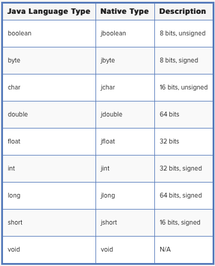

JNI-Learning
============

My environment:

- OS: Mac 10.10.1
- c compiler: Apple LLVM version 6.0

## Notes

### example/hellojni tutorial

This is based on the [JavaNativeInterface][1] and 
[Java Fundamentals Tutorial : Java Native Interface Jni][2].

Notice the header file, listed below, has many types -- 
**Type Conversion** .

- Primitive type matching:

	

- Reference types

	JNI passes objects to native methods as opaque references, C
	pointer types that refer to internal data structures in the JVM.

	```C
	JNIEXPORT void JNICALL Java_com_marakana_jniexamples_Hello_sayHi
	  (JNIEnv *, jobject, jstring, jint);
	```

- Native Method Arguments:

	- `JNIEnv`: 

		pointer that points to another pointer pointing to a function
		table (array of pointer). Each entry in this function table
		points to a JNI function. These are the functions we are going
		to use for type conversion

	- `jobject`:

		It's the second argument for **instance method**, refering to
		the object on which the method is invoked.

	- `jclass`:

		It's the second argument for **static method** refering to 
		the class in which the method is define.

- String Conversion
	
	- `(*env)->GetStringUTFChars(env, who, &iscopy);`

		Convert java String to C string.

	- Other mathod can be found in [JNI Functions][4].


## Questions

### Where can I find the jni headers for Mac OS

```CMake
HelloJNI.o : HelloJNI.c HelloJNI.h
gcc -I"/System/Library/Frameworks/JavaVM.framework/Headers" -fpic -c $< -o $@
```

### What kind of extension is loaded on Max?

`.jnilib` extension is used. Refer to [Mac Developer Library][3].

For example, if the files hello.c and hola.c contain the
implementations of the native methods to be built into a dynamic
shared JNI library that will be called with
System.loadLibrary(“hello”), you would build the resultant library,
libhello.jnilib, with this code:

```CMake
cc -c -I/System/Library/Frameworks/JavaVM.framework/Headers hola.c
cc -c -I/System/Library/Frameworks/JavaVM.framework/Headers hello.c
cc -dynamiclib -o libhello.jnilib hola.o hello.o -framework JavaVM
```

Often JNI libraries have interdependencies. For example assume the 
following:

- libA.jnilib contains a function foo().
- libB.jnilib needs to link against libA.jnilib to make use of foo().

### Naming of `jnilib`

Refer to the *example/hellojni* :

```java
System.loadLibrary("HelloImpl");
```

```CMake
gcc -o libHelloImpl.jnilib -lc -shared 
	-I"/System/Library/Frameworks/JavaVM.framework/Headers" Hello.c # -> jnilib

export LD_LIBRARY_PATH=.
```

When we load libray **AAA**, LD_LIBRARY_PATH must be **libAAA**.

### `java.lang.UnsatisfiedLinkError`

Common mistakes resulting in java.lang.UnsatisfiedLinkError usually
come from incorrect  naming of the shared library (O/S-dependent), the
library not being in the search path, or wrong library being loaded by
Java code.


[1]: https://www3.ntu.edu.sg/home/ehchua/programming/java/JavaNativeInterface.html
[2]: https://thenewcircle.com/static/bookshelf/java_fundamentals_tutorial/_java_native_interface_jni.html
[3]: https://developer.apple.com/library/mac/documentation/Java/Conceptual/Java14Development/05-CoreJavaAPIs/CoreJavaAPIs.html
[4]: http://docs.oracle.com/javase/6/docs/technotes/guides/jni/spec/functions.html